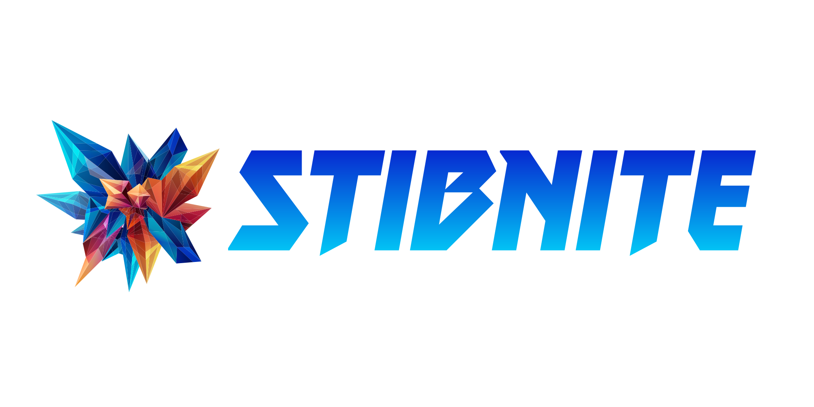

<p align="center">
    <a href="https://github.com/csci-arch/stibnite/releases">
        
    </a>
    <a href="https://pypi.org/project/stibnite/">
        
    </a>
    <a href="/LICENSE">
        
    </a>
    <a href="https://github.com/csci-arch/stibnite/graphs/contributors">
        
    </a>
    <a href="https://github.com/csci-arch/stibnite/actions">
        
    </a>
    <a href="https://github.com/csci-arch/stibnite/issues?q=is%3Aopen+is%3Aissue+label%3Aenhancement">
        
    </a>
    <a href="https://github.com/csci-arch/stibnite/stargazers">
        
    </a>
    <a href="https://github.com/csci-arch/stibnite/issues?q=is%3Aissue+is%3Aopen+milestone%3Av1.0.0">
        
    </a>
</p>

------
<p align="center">
    Stibnite is an automated documentation generator that can work with different docstring styles. (and hopefully in the future different programming languages)
    <br />
    <br />
    <a href="https://github.com/csci-arch/stibnite/issues/new?assignees=&labels=bug&template=bug_report.md&title=">Report Bug</a>
    ·
    <a href="https://github.com/csci-arch/stibnite/issues/new?assignees=&labels=bug&template=feature_request.md&title=">Request Feature</a>
  </p>

## Table of Contents

* [About The Project](#about-the-project)
  * [Features](#features)
    * [Supported Languages](#supported-languages)
    * [Supported Docstring Styles](#supported-docstring-styles)
* [Installation](#installation)
* [Usage](#usage)
* [Roadmap](#roadmap)  
* [License](#license)
* [Contact](#contact)
* [Disclaimer](#disclaimer)

### About The Project

Stibnite is a powerful tool that can create a website for the documentation of your codebase by parsing python files (for now), extracting docstrings from functions, classes, methods and, etc. and creating a stylized markdown based webpage using [mkdocs](https://www.mkdocs.org/).

#### Features

It can
* parse python files to extract docstrings
* parse docstrings to create a webpage
* create a website out of your codebase
* customize the output based on your choices
* ignore the files that you don't want them to be in the documentation

##### Supported Languages

> * Python

##### Supported Docstring Styles

> * reStructured Text
> * Markdown

### Installation

The easiest way to install this tool is via pip
```
pip install stibnite
```

### Usage

 **Still in development process**

### Roadmap

Our vision for this project is to create a tool that can automatically create a customizable documentation in every possible language with every possible docstring style to free the software developers from the burden of writing dreaded documentation.

You can reach what we are planning for our next version in [here](https://github.com/csci-arch/stibnite/milestones)

### License

Distributed under the [```Apache 2.0```](https://www.apache.org/licenses/LICENSE-2.0) License. See [```LICENSE```](/LICENSE) for more information.

### Contact


<p align="center">
    <a href="https://discord.gg/kXXeJX66Xb">
        
    </a>
    <a href="https://linkedin.com/in/izzettunc">
        
    </a>
    <a href="https://linkedin.com/in/tolgailtuzer">
        
    </a>
</p>

### Disclaimer

As the developers of this project we take it as one's duty to thank [AlexandreKempf](https://github.com/AlexandreKempf) and [other contributers](https://github.com/AlexandreKempf/automacdoc/graphs/contributors) in the [automacdoc](https://github.com/AlexandreKempf/automacdoc) project as they are the visionary fathers/mothers of stibnite and [Hikmet Dogan](https://www.instagram.com/cizerfalan/) for his beautiful work on our logo.

<p align="center">
    <a href="https://python.org">
        
    </a>
    
    
</p>
<br />
